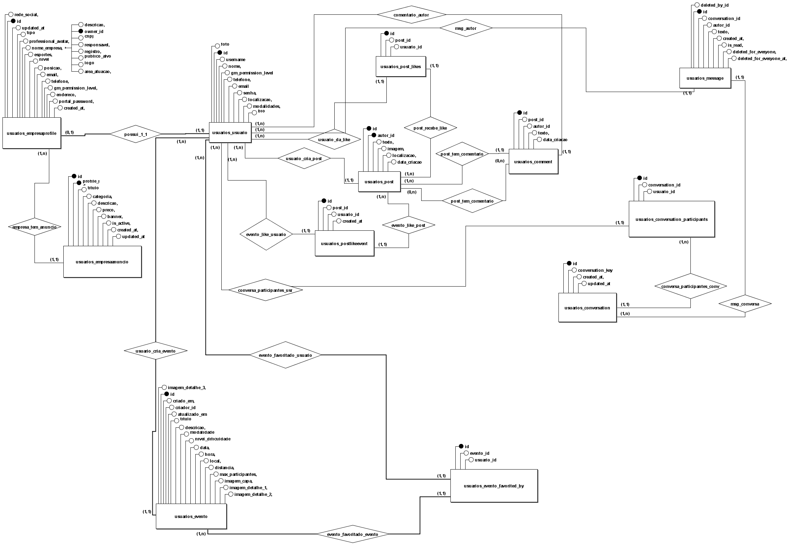
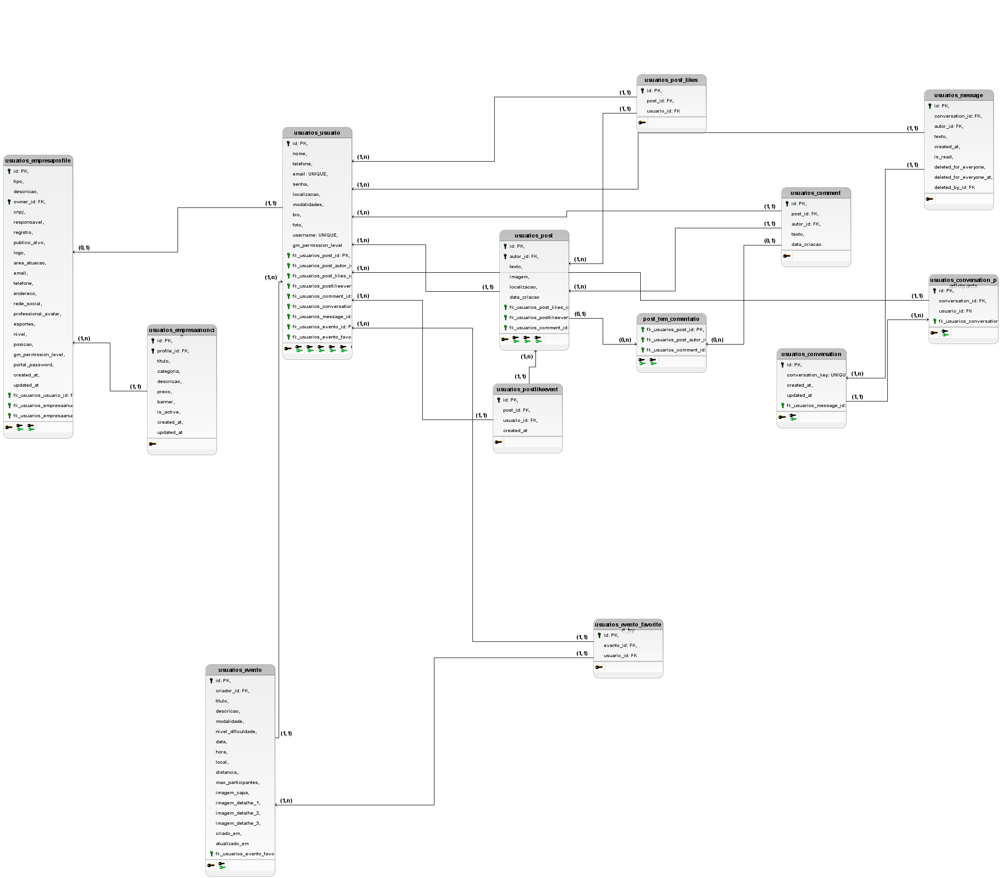
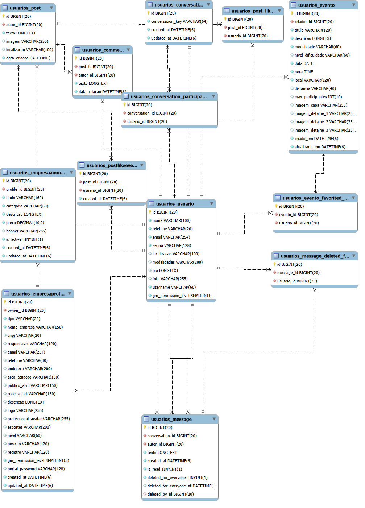

# Modelo Relacional (estilo MySQL Workbench) — Grupo 7: Coony
> bem vindo ao nosso projeto Coony
[](https://pokemondb.net/pokedex/pikachu)

Autores:
- Joelyson Alcantara da Silva
- Pedro Lucas de Souza Pessoa
- Arthur Thadeu
- Edvaldo Alves

> Este Modelo Relacional (MR) foi elaborado a partir dos modelos Django em `usuarios/models.py` e representa o desenho físico do banco de dados: entidades, chaves primárias/estrangeiras, relacionamentos 1:N e N:N, regras de integridade e considerações de ordenação/índices.


## Sumário 
- [Entidades e Atributos](#entidades-e-atributos)
- [Relacionamentos (Cardinalidade)](#relacionamentos-cardinalidade)
- [Regras de Integridade e Restrições](#regras-de-integridade-e-restrições)
- [Notas sobre Triggers](#notas-sobre-triggers-e-restrições-adicionais)
- [Relatório de Minimundos](#relatório-de-minimundos-do-banco-de-dados—coony)
- [Esquema Físico MySQL (DDL)](#esquema-físico-mysql-ddl)

[](https://pokemondb.net/pokedex/pichu)
## Entidades e Atributos

### Usuario
- **PK:** `id`
- **Atributos:** `nome (varchar100)`, `telefone (varchar20)`, `email (unique)`, `senha (varchar128, hashed)`, `localizacao? (varchar100)`, `modalidades? (varchar200)`, `bio? (text)`, `foto? (path)`, `username (slug, unique, max 60)`, `gm_permission_level (smallint, default 0)`
- **Observações:** funções de aplicação para hash de senha (`set_password`, `check_password`) e geração de `username` único ao salvar.

### EmpresaProfile
- **PK:** `id`
- **FK (1:1):** `owner_id` → `Usuario.id` (unique)
- **Atributos:** `tipo (empresa|profissional)`, `nome_empresa`, `cnpj?`, `responsavel?`, `email?`, `telefone?`, `endereco?`, `area_atuacao?`, `publico_alvo?`, `rede_social?`, `descricao?`, `logo? (path)`, `professional_avatar? (path)`, `esportes?`, `nivel?`, `posicao?`, `registro?`, `gm_permission_level (default 1)`, `portal_password? (hashed)`, `created_at`, `updated_at`
- **Ao excluir:** CASCADE

### EmpresaAnuncio
- **PK:** `id`
- **FK (N:1):** `profile_id` → `EmpresaProfile.id`
- **Atributos:** `titulo`, `categoria`, `descricao`, `preco (decimal10,2)`, `banner? (path)`, `is_active (bool)`, `created_at`, `updated_at`
- **Ao excluir:** CASCADE; **Ordenação:** `-created_at`

### Post
- **PK:** `id`
- **FK (N:1):** `autor_id` → `Usuario.id`
- **Atributos:** `texto`, `imagem? (path)`, `localizacao?`, `data_criacao`
- **M:N:** `likes` ↔ `Usuario` via `usuarios_post_likes`
- **Ao excluir:** CASCADE; **Ordenação:** `-data_criacao`

### PostLikeEvent
- **PK:** `id`
- **FK (N:1):** `post_id` → `Post.id`
- **FK (N:1):** `usuario_id` → `Usuario.id`
- **Atributos:** `created_at`
- **Restrições:** `unique_together (post_id, usuario_id)`; **Ordenação:** `-created_at`

### Comment
- **PK:** `id`
- **FK (N:1):** `post_id` → `Post.id`
- **FK (N:1):** `autor_id` → `Usuario.id`
- **Atributos:** `texto`, `data_criacao`
- **Ao excluir:** CASCADE; **Ordenação:** `data_criacao`

### Conversation
- **PK:** `id`
- **Atributos:** `conversation_key (unique)`, `created_at`, `updated_at`
- **M:N:** `participants` ↔ `Usuario` via `usuarios_conversation_participants`
- **Ordenação:** `-updated_at`
- **Observações:** funções de aplicação para construir chaves determinísticas, garantir participantes e atualizar `updated_at` via `touch()`.

### Message
- **PK:** `id`
- **FK (N:1):** `conversation_id` → `Conversation.id`
- **FK (N:1):** `autor_id` → `Usuario.id`
- **Atributos:** `texto`, `created_at`, `is_read (bool)`, `deleted_for_everyone (bool)`, `deleted_for_everyone_at?`, `deleted_by_id?` (N:1 → `Usuario.id`, SET NULL)
- **M:N:** `deleted_for` ↔ `Usuario` via `usuarios_message_deleted_for`
- **Ordenação:** `created_at`

### Evento
- **PK:** `id`
- **FK (N:1):** `criador_id` → `Usuario.id`
- **Atributos:** `titulo`, `descricao`, `modalidade`, `nivel_dificuldade?`, `data (date)`, `hora (time)`, `local`, `distancia?`, `max_participantes? (int)`, `imagem_capa?`, `imagem_detalhe_1?/_2?/_3?`, `criado_em`, `atualizado_em`
- **M:N:** `favorited_by` ↔ `Usuario` via `usuarios_evento_favorited_by`
- **Ordenação:** `-data`, `-hora`, `-criado_em`

## Relacionamentos (Cardinalidade)

### 1:1
- `Usuario` ↔ `EmpresaProfile` (`EmpresaProfile.owner` unique)

### 1:N
- `Usuario` → `Post`
- `Post` → `Comment`
- `EmpresaProfile` → `EmpresaAnuncio`
- `Conversation` → `Message`
- `Usuario` → `Message` (autor)
- `Usuario` → `Evento` (criador)

### N:N (via tabelas de junção)
- `Post.likes` ↔ `Usuario` → `usuarios_post_likes`
- `Conversation.participants` ↔ `Usuario` → `usuarios_conversation_participants`
- `Message.deleted_for` ↔ `Usuario` → `usuarios_message_deleted_for`
- `Evento.favorited_by` ↔ `Usuario` → `usuarios_evento_favorited_by`

## Regras de Integridade e Restrições

- **Unicidade:** `Usuario.email`, `Usuario.username`, `Conversation.conversation_key`, `PostLikeEvent (post_id, usuario_id)`
- **Chaves estrangeiras:** CASCADE na maioria dos relacionamentos; `Message.deleted_by` usa SET NULL
- **Nullabilidade:** Campos opcionais (`?`) aceitam NULL; campos obrigatórios são NOT NULL.
- **Indexação e Ordenação:** Índices implícitos em FKs; índices adicionais úteis descritos no DDL para desempenho em ordenações por tempo e consultas.

## Notas sobre Triggers e Restrições Adicionais

- Não há triggers definidos na aplicação nos modelos Django; a integridade é garantida via FKs e restrições de unicidade.
- Se necessário para operações fora da aplicação, triggers MySQL podem manter `updated_at` ou auditar logs, porém o código da aplicação já atualiza timestamps.

Aqui está um **relatório completo e profissional de Minimundos**, totalmente baseado no **script SQL** que você enviou.
O texto está estruturado, claro e pronto para usar em documentação, projeto de faculdade ou análise de requisitos.

---
[](https://pokemondb.net/pokedex/mew)
# ✅ **RELATÓRIO DOS MINIMUNDOS DO BANCO DE DADOS — COONY**

O sistema modelado pelo banco de dados representa uma plataforma social e comercial voltada para **usuários, empresas, anúncios, eventos, publicações, conversas e interações**.
Os minimundos a seguir descrevem, em linguagem natural, as regras e comportamentos que orientam a modelagem.

---

# 📌 **1. Minimundo: Usuários**

O sistema armazena informações de usuários, que podem ser pessoas comuns ou empresas.
Cada usuário possui um perfil com dados básicos como nome, telefone, e-mail, senha, localização e biografia.

Regras:

* Cada usuário possui um **username único** e **e-mail único**.
* O usuário pode ter um nível de permissão (campo `gm_permission_level`).
* Usuários podem criar posts, comentários, mensagens, eventos e podem interagir com outros usuários e conteúdos.

---

# 📌 **2. Minimundo: Perfil Empresarial**

Usuários podem possuir um **perfil empresarial**, que contém informações do negócio:

* Nome da empresa, CNPJ, responsável.
* Área de atuação, público-alvo, redes sociais.
* Logo, avatar profissional e descrição.
* Esportes, nível, posição e registro.
* Campos administrativos como `portal_password`, datas de criação e atualização.

Regras:

* **Um usuário possui no máximo um Perfil Empresarial** (relação 1:1).
* O perfil é removido automaticamente caso o usuário seja excluído (ON DELETE CASCADE).
* O perfil empresarial pode criar anúncios de serviços.

---

# 📌 **3. Minimundo: Anúncios (EmpresaAnuncio)**

Empresas podem divulgar seus serviços ou produtos através de anúncios:

* Cada anúncio inclui título, categoria, descrição, preço e banner.
* Os anúncios possuem status ativo/inativo e datas de criação e atualização.

Regras:

* **Cada perfil empresarial pode criar vários anúncios**.
* **Cada anúncio pertence exatamente a um único perfil empresarial**.

---

# 📌 **4. Minimundo: Postagens (Posts)**

Usuários podem criar publicações dentro da plataforma:

* O post contém texto, imagem, localização e data de criação.
* Um post pertence sempre a **um único autor**.

Regras:

* Um usuário pode criar vários posts.
* A exclusão do usuário remove também os seus posts.

---

# 📌 **5. Minimundo: Likes e Eventos de Like (audit trail)**

Existem dois sistemas distintos relacionados a curtidas:

### 5.1 Likes (usuarios_post_likes)

Armazena quem curtiu qual post.

Regras:

* Um usuário pode curtir vários posts.
* Um post pode ser curtido por vários usuários.
* Um usuário só pode curtir o mesmo post **uma vez** (unicidade post + usuário).

### 5.2 PostLikeEvent

Registro histórico de ações de like.

Regras:

* Gera um evento quando um usuário curte um post.
* Também é único por par (post, usuário), evitando duplicações.
* Usado como auditoria ou trilha de atividade.

---

# 📌 **6. Minimundo: Comentários**

Usuários podem comentar posts.

Regras:

* Um post pode ter vários comentários.
* Um usuário pode fazer vários comentários.
* Cada comentário pertence ao usuário que o escreveu e ao post comentado.
* Comentários são excluídos se o post ou autor for removido.

---

# 📌 **7. Minimundo: Conversas (Chats)**

As conversas representam o sistema de mensagens privadas da plataforma.

Regras:

* Cada conversa possui uma chave única (`conversation_key`) usada para identificar diálogos entre usuários.
* Pode envolver **dois ou mais usuários**.

---

# 📌 **8. Minimundo: Participantes da Conversa**

A tabela `usuarios_conversation_participants` define quais usuários participam de cada conversa.

Regras:

* Uma conversa pode ter vários participantes.
* Um usuário pode participar de várias conversas.
* Cada combinação (conversa, usuário) é única.
* A exclusão da conversa remove todos os participantes associados.

---

# 📌 **9. Minimundo: Mensagens**

Usuários podem enviar mensagens dentro de uma conversa.

Regras:

* Cada mensagem pertence a uma conversa.
* Cada mensagem tem um autor.
* Mensagens podem ser marcadas como lidas ou deletadas para todos.
* Se o autor for removido, mensagens permanecem, mas `deleted_by_id` pode ficar nulo.
* Mensagens possuem histórico de deleção.

---

# 📌 **10. Minimundo: Mensagens Deletadas para Usuários Específicos**

A tabela `usuarios_message_deleted_for` mantém o registro de mensagens ocultadas apenas no lado do usuário.

Regras:

* Uma mensagem pode estar oculta para vários usuários.
* Um usuário pode ocultar várias mensagens.
* Uma mensagem só pode ser marcada como deletada uma vez por cada usuário.

---

# 📌 **11. Minimundo: Eventos Esportivos**

Usuários podem criar eventos esportivos com detalhes como:

* Título, descrição, modalidade, nível de dificuldade.
* Data, hora, local e distância.
* Número máximo de participantes.
* Imagens do evento.

Regras:

* Apenas usuários podem criar eventos.
* Um usuário pode criar vários eventos.
* Eventos possuem data de criação e atualização.

---

# 📌 **12. Minimundo: Favoritos de Eventos**

O sistema permite que usuários favoritem eventos.

Regras:

* Um evento pode ser favoritado por vários usuários.
* Um usuário pode favoritar vários eventos.
* Um usuário só pode favoritar o mesmo evento **uma única vez**.
* A remoção do evento apaga automaticamente os favoritos.

---

# 📌 **13. Minimundo Geral da Plataforma**

O banco como um todo representa uma rede social esportiva / marketplace com:

* Usuários normais e empresariais
* Anúncios de serviços
* Posts, likes e comentários
* Sistema completo de chat
* Criação de eventos e sistema de favoritos
* Auditoria de interações

A modelagem cobre operações sociais, comerciais e de comunicação.

---

[](https://pokemondb.net/pokedex/mewtwo)
# Esquema Físico MySQL (DDL)

O DDL abaixo implementa as entidades e relações identificadas no modelo relacional, utilizando o engine InnoDB e o charset utf8mb4.

```sql
SET NAMES utf8mb4;
SET FOREIGN_KEY_CHECKS = 0;

-- Usuario
CREATE TABLE `usuarios_usuario` (
  `id` BIGINT UNSIGNED NOT NULL AUTO_INCREMENT,
  `nome` VARCHAR(100) NOT NULL,
  `telefone` VARCHAR(20) NOT NULL,
  `email` VARCHAR(254) NOT NULL,
  `senha` VARCHAR(128) NOT NULL,
  `localizacao` VARCHAR(100),
  `modalidades` VARCHAR(200),
  `bio` LONGTEXT,
  `foto` VARCHAR(255),
  `username` VARCHAR(60) NOT NULL,
  `gm_permission_level` SMALLINT UNSIGNED NOT NULL DEFAULT 0,
  PRIMARY KEY (`id`),
  UNIQUE KEY `uniq_usuarios_email` (`email`),
  UNIQUE KEY `uniq_usuarios_username` (`username`)
) ENGINE=InnoDB DEFAULT CHARSET=utf8mb4;

-- EmpresaProfile (1:1 Usuario)
CREATE TABLE `usuarios_empresaprofile` (
  `id` BIGINT UNSIGNED NOT NULL AUTO_INCREMENT,
  `owner_id` BIGINT UNSIGNED NOT NULL,
  `tipo` VARCHAR(20) NOT NULL DEFAULT 'empresa',
  `nome_empresa` VARCHAR(150) NOT NULL,
  `cnpj` VARCHAR(20),
  `responsavel` VARCHAR(120),
  `email` VARCHAR(254),
  `telefone` VARCHAR(30),
  `endereco` VARCHAR(200),
  `area_atuacao` VARCHAR(150),
  `publico_alvo` VARCHAR(150),
  `rede_social` VARCHAR(150),
  `descricao` LONGTEXT,
  `logo` VARCHAR(255),
  `professional_avatar` VARCHAR(255),
  `esportes` VARCHAR(200),
  `nivel` VARCHAR(60),
  `posicao` VARCHAR(120),
  `registro` VARCHAR(120),
  `gm_permission_level` SMALLINT UNSIGNED NOT NULL DEFAULT 1,
  `portal_password` VARCHAR(128),
  `created_at` DATETIME(6) NOT NULL,
  `updated_at` DATETIME(6) NOT NULL,
  PRIMARY KEY (`id`),
  UNIQUE KEY `uniq_empresaprofile_owner` (`owner_id`),
  CONSTRAINT `fk_empresaprofile_owner` FOREIGN KEY (`owner_id`)
    REFERENCES `usuarios_usuario` (`id`) ON DELETE CASCADE
) ENGINE=InnoDB DEFAULT CHARSET=utf8mb4;

-- EmpresaAnuncio (N:1 EmpresaProfile)
CREATE TABLE `usuarios_empresaanuncio` (
  `id` BIGINT UNSIGNED NOT NULL AUTO_INCREMENT,
  `profile_id` BIGINT UNSIGNED NOT NULL,
  `titulo` VARCHAR(160) NOT NULL,
  `categoria` VARCHAR(60) NOT NULL,
  `descricao` LONGTEXT NOT NULL,
  `preco` DECIMAL(10,2) NOT NULL,
  `banner` VARCHAR(255),
  `is_active` TINYINT(1) NOT NULL DEFAULT 1,
  `created_at` DATETIME(6) NOT NULL,
  `updated_at` DATETIME(6) NOT NULL,
  PRIMARY KEY (`id`),
  KEY `idx_empresaanuncio_profile` (`profile_id`),
  KEY `idx_empresaanuncio_created_at` (`created_at`),
  CONSTRAINT `fk_empresaanuncio_profile` FOREIGN KEY (`profile_id`)
    REFERENCES `usuarios_empresaprofile` (`id`) ON DELETE CASCADE
) ENGINE=InnoDB DEFAULT CHARSET=utf8mb4;

-- Post (N:1 Usuario) + likes M:N
CREATE TABLE `usuarios_post` (
  `id` BIGINT UNSIGNED NOT NULL AUTO_INCREMENT,
  `autor_id` BIGINT UNSIGNED NOT NULL,
  `texto` LONGTEXT NOT NULL,
  `imagem` VARCHAR(255),
  `localizacao` VARCHAR(100),
  `data_criacao` DATETIME(6) NOT NULL,
  PRIMARY KEY (`id`),
  KEY `idx_post_autor` (`autor_id`),
  KEY `idx_post_data_criacao` (`data_criacao`),
  CONSTRAINT `fk_post_autor` FOREIGN KEY (`autor_id`)
    REFERENCES `usuarios_usuario` (`id`) ON DELETE CASCADE
) ENGINE=InnoDB DEFAULT CHARSET=utf8mb4;

CREATE TABLE `usuarios_post_likes` (
  `id` BIGINT UNSIGNED NOT NULL AUTO_INCREMENT,
  `post_id` BIGINT UNSIGNED NOT NULL,
  `usuario_id` BIGINT UNSIGNED NOT NULL,
  PRIMARY KEY (`id`),
  UNIQUE KEY `uniq_post_like_pair` (`post_id`, `usuario_id`),
  KEY `idx_post_likes_usuario` (`usuario_id`),
  CONSTRAINT `fk_post_likes_post` FOREIGN KEY (`post_id`)
    REFERENCES `usuarios_post` (`id`) ON DELETE CASCADE,
  CONSTRAINT `fk_post_likes_usuario` FOREIGN KEY (`usuario_id`)
    REFERENCES `usuarios_usuario` (`id`) ON DELETE CASCADE
) ENGINE=InnoDB DEFAULT CHARSET=utf8mb4;

-- PostLikeEvent (auditoria com unicidade)
CREATE TABLE `usuarios_postlikeevent` (
  `id` BIGINT UNSIGNED NOT NULL AUTO_INCREMENT,
  `post_id` BIGINT UNSIGNED NOT NULL,
  `usuario_id` BIGINT UNSIGNED NOT NULL,
  `created_at` DATETIME(6) NOT NULL,
  PRIMARY KEY (`id`),
  UNIQUE KEY `uniq_postlikeevent_pair` (`post_id`, `usuario_id`),
  KEY `idx_postlikeevent_created_at` (`created_at`),
  CONSTRAINT `fk_postlikeevent_post` FOREIGN KEY (`post_id`)
    REFERENCES `usuarios_post` (`id`) ON DELETE CASCADE,
  CONSTRAINT `fk_postlikeevent_usuario` FOREIGN KEY (`usuario_id`)
    REFERENCES `usuarios_usuario` (`id`) ON DELETE CASCADE
) ENGINE=InnoDB DEFAULT CHARSET=utf8mb4;

-- Comment (N:1 Post, N:1 Usuario)
CREATE TABLE `usuarios_comment` (
  `id` BIGINT UNSIGNED NOT NULL AUTO_INCREMENT,
  `post_id` BIGINT UNSIGNED NOT NULL,
  `autor_id` BIGINT UNSIGNED NOT NULL,
  `texto` LONGTEXT NOT NULL,
  `data_criacao` DATETIME(6) NOT NULL,
  PRIMARY KEY (`id`),
  KEY `idx_comment_post` (`post_id`),
  KEY `idx_comment_autor` (`autor_id`),
  CONSTRAINT `fk_comment_post` FOREIGN KEY (`post_id`)
    REFERENCES `usuarios_post` (`id`) ON DELETE CASCADE,
  CONSTRAINT `fk_comment_autor` FOREIGN KEY (`autor_id`)
    REFERENCES `usuarios_usuario` (`id`) ON DELETE CASCADE
) ENGINE=InnoDB DEFAULT CHARSET=utf8mb4;

-- Conversation (chat) + participantes M:N
CREATE TABLE `usuarios_conversation` (
  `id` BIGINT UNSIGNED NOT NULL AUTO_INCREMENT,
  `conversation_key` VARCHAR(64) NOT NULL,
  `created_at` DATETIME(6) NOT NULL,
  `updated_at` DATETIME(6) NOT NULL,
  PRIMARY KEY (`id`),
  UNIQUE KEY `uniq_conversation_key` (`conversation_key`)
) ENGINE=InnoDB DEFAULT CHARSET=utf8mb4;

CREATE TABLE `usuarios_conversation_participants` (
  `id` BIGINT UNSIGNED NOT NULL AUTO_INCREMENT,
  `conversation_id` BIGINT UNSIGNED NOT NULL,
  `usuario_id` BIGINT UNSIGNED NOT NULL,
  PRIMARY KEY (`id`),
  UNIQUE KEY `uniq_conversation_participant` (`conversation_id`, `usuario_id`),
  KEY `idx_conv_part_usuario` (`usuario_id`),
  CONSTRAINT `fk_conv_part_conversation` FOREIGN KEY (`conversation_id`)
    REFERENCES `usuarios_conversation` (`id`) ON DELETE CASCADE,
  CONSTRAINT `fk_conv_part_usuario` FOREIGN KEY (`usuario_id`)
    REFERENCES `usuarios_usuario` (`id`) ON DELETE CASCADE
) ENGINE=InnoDB DEFAULT CHARSET=utf8mb4;

-- Message (mensagens do chat) + deleted_for M:N
CREATE TABLE `usuarios_message` (
  `id` BIGINT UNSIGNED NOT NULL AUTO_INCREMENT,
  `conversation_id` BIGINT UNSIGNED NOT NULL,
  `autor_id` BIGINT UNSIGNED NOT NULL,
  `texto` LONGTEXT NOT NULL,
  `created_at` DATETIME(6) NOT NULL,
  `is_read` TINYINT(1) NOT NULL DEFAULT 0,
  `deleted_for_everyone` TINYINT(1) NOT NULL DEFAULT 0,
  `deleted_for_everyone_at` DATETIME(6),
  `deleted_by_id` BIGINT UNSIGNED,
  PRIMARY KEY (`id`),
  KEY `idx_message_conversation` (`conversation_id`),
  KEY `idx_message_autor` (`autor_id`),
  KEY `idx_message_deleted_by` (`deleted_by_id`),
  CONSTRAINT `fk_message_conversation` FOREIGN KEY (`conversation_id`)
    REFERENCES `usuarios_conversation` (`id`) ON DELETE CASCADE,
  CONSTRAINT `fk_message_autor` FOREIGN KEY (`autor_id`)
    REFERENCES `usuarios_usuario` (`id`) ON DELETE CASCADE,
  CONSTRAINT `fk_message_deleted_by` FOREIGN KEY (`deleted_by_id`)
    REFERENCES `usuarios_usuario` (`id`) ON DELETE SET NULL
) ENGINE=InnoDB DEFAULT CHARSET=utf8mb4;

CREATE TABLE `usuarios_message_deleted_for` (
  `id` BIGINT UNSIGNED NOT NULL AUTO_INCREMENT,
  `message_id` BIGINT UNSIGNED NOT NULL,
  `usuario_id` BIGINT UNSIGNED NOT NULL,
  PRIMARY KEY (`id`),
  UNIQUE KEY `uniq_message_deleted_for_pair` (`message_id`, `usuario_id`),
  KEY `idx_msg_del_for_usuario` (`usuario_id`),
  CONSTRAINT `fk_msg_del_for_message` FOREIGN KEY (`message_id`)
    REFERENCES `usuarios_message` (`id`) ON DELETE CASCADE,
  CONSTRAINT `fk_msg_del_for_usuario` FOREIGN KEY (`usuario_id`)
    REFERENCES `usuarios_usuario` (`id`) ON DELETE CASCADE
) ENGINE=InnoDB DEFAULT CHARSET=utf8mb4;

-- Evento + favorited_by M:N
CREATE TABLE `usuarios_evento` (
  `id` BIGINT UNSIGNED NOT NULL AUTO_INCREMENT,
  `criador_id` BIGINT UNSIGNED NOT NULL,
  `titulo` VARCHAR(120) NOT NULL,
  `descricao` LONGTEXT NOT NULL,
  `modalidade` VARCHAR(60) NOT NULL,
  `nivel_dificuldade` VARCHAR(60),
  `data` DATE NOT NULL,
  `hora` TIME NOT NULL,
  `local` VARCHAR(120) NOT NULL,
  `distancia` VARCHAR(40),
  `max_participantes` INT UNSIGNED,
  `imagem_capa` VARCHAR(255),
  `imagem_detalhe_1` VARCHAR(255),
  `imagem_detalhe_2` VARCHAR(255),
  `imagem_detalhe_3` VARCHAR(255),
  `criado_em` DATETIME(6) NOT NULL,
  `atualizado_em` DATETIME(6) NOT NULL,
  PRIMARY KEY (`id`),
  KEY `idx_evento_criador` (`criador_id`),
  KEY `idx_evento_data_hora` (`data`, `hora`),
  CONSTRAINT `fk_evento_criador` FOREIGN KEY (`criador_id`)
    REFERENCES `usuarios_usuario` (`id`) ON DELETE CASCADE
) ENGINE=InnoDB DEFAULT CHARSET=utf8mb4;

CREATE TABLE `usuarios_evento_favorited_by` (
  `id` BIGINT UNSIGNED NOT NULL AUTO_INCREMENT,
  `evento_id` BIGINT UNSIGNED NOT NULL,
  `usuario_id` BIGINT UNSIGNED NOT NULL,
  PRIMARY KEY (`id`),
  UNIQUE KEY `uniq_evento_favorited_pair` (`evento_id`, `usuario_id`),
  KEY `idx_evento_favorited_usuario` (`usuario_id`),
  CONSTRAINT `fk_evento_fav_evento` FOREIGN KEY (`evento_id`)
    REFERENCES `usuarios_evento` (`id`) ON DELETE CASCADE,
  CONSTRAINT `fk_evento_fav_usuario` FOREIGN KEY (`usuario_id`)
    REFERENCES `usuarios_usuario` (`id`) ON DELETE CASCADE
) ENGINE=InnoDB DEFAULT CHARSET=utf8mb4;

SET FOREIGN_KEY_CHECKS = 1;
```
[](https://pokemondb.net/pokedex/meowth)

## Notas
- Os nomes das tabelas seguem a convenção app-model; se as migrations utilizarem nomes diferentes, ajuste conforme necessário.
- Campos de imagem são caminhos (paths); o armazenamento é gerenciado pelo Django.
- A precisão de timestamps usa `DATETIME(6)` para refletir os microsegundos do Django.
- Índices adicionais podem ser adicionados conforme padrões de consulta (por exemplo, para `EmpresaAnuncio.is_active`).

## MODELO CONCEITUAL: 

## MODELO LOGICO:

## MODELO FÍSICO:



## me conta, quantos pokémon você encontrou?
